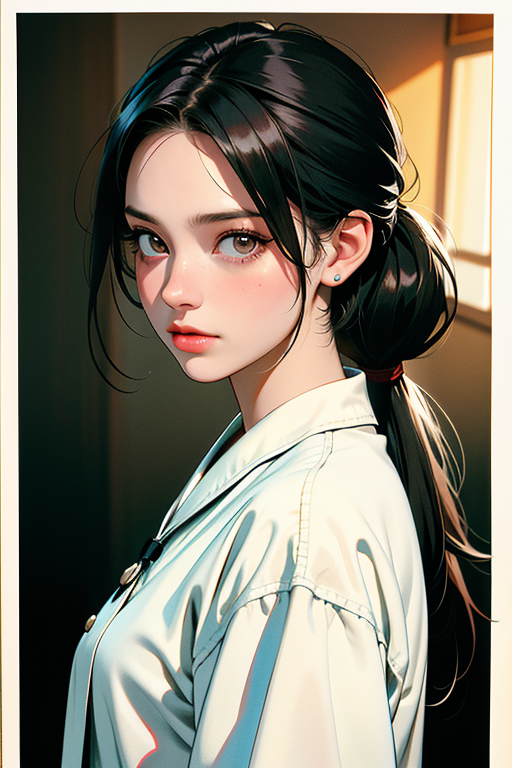
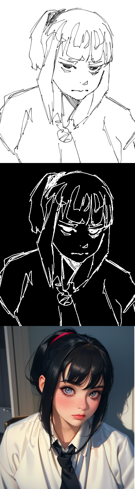

# Setup
Create directories files.
```bash
mkdir -p src/sks
mkdir -p .venv/venv
```
## Dependencies
Download dependencies.
- [Base model](https://huggingface.co/Meina/MeinaMix_V10/tree/main)
- [Controlnet model](https://huggingface.co/lllyasviel/sd-controlnet-scribble)

Install dependencies inside a python venv.
```bash
git clone https://github.com/AguilarLagunasArturo/diffusers.git .venv
python -m venv .venv/venv
source .venv/venv/bin/activate
pip install -U git+https://github.com/AguilarLagunasArturo/diffusers.git
pip install omegaconf
pip install transformers safetensors accelerate
```

## Configure scripts
Replace the paths where you stored the models.
```python
PATH_TO_HF_MODELS = os.path.join(HOME, "<path/to/base/models>")
PATH_TO_CN_MODELS = os.path.join(HOME, "<path/to/controlnet/models>")
```

# Run script
## Test base model
```bash
python txt2img.py
```
## Test sketch to image pipeline
Place your sketches in `src/sks`.
```bash
python sketch2img.py
```
# Results
|Input|Output|
|:-|:-|
|**Prompt:** (masterpiece,best quality,hires,high resolution:1.2),(extremely detailed,realistic,intricate details),(nigh light,ominous,dark ambient),3d,cg,1girl,portrait,sad,eye bags,white uniform,tie,pony tail,black hair,looking at viewer,1960s \(style\),vintage fantasy,film grain **Negative:** (worst quality:2), (low quality:2),(normal quality:2), lowres, bad anatomy,((extra limbs)),((extra legs)),((fused legs)),((extra arms)),((fused arms)),normal quality, ((monochrome)), ((grayscale)), ((watermark)), uneven eyes, lazy eye,(((mutated hand))),multiple navel,ornaments,((lowres:1.8)),((blurry:1.8)),noise, **Size:** (512, 768) **Steps:** 32 **Seed:** 78471  **Model:** [astranime](https://civitai.com/models/248011?modelVersionId=334482)||
|**Prompt:** (masterpiece,best quality,hires,high resolution:1.2),(extremely detailed,realistic,intricate details),(nigh light,ominous,dark ambient),3d,cg,1girl,portrait,sad,eye bags,white uniform,tie,pony tail,black hair,looking at viewer,1960s \(style\),vintage fantasy,film grain **Negative:** (worst quality:2), (low quality:2),(normal quality:2), lowres, bad anatomy,((extra limbs)),((extra legs)),((fused legs)),((extra arms)),((fused arms)),normal quality, ((monochrome)), ((grayscale)), ((watermark)), uneven eyes, lazy eye,(((mutated hand))),multiple navel,ornaments, **Size:** (512, 512) **Steps:** 32 **Seed:** 8318 **Model:** [astranime](https://civitai.com/models/248011?modelVersionId=334482)||
